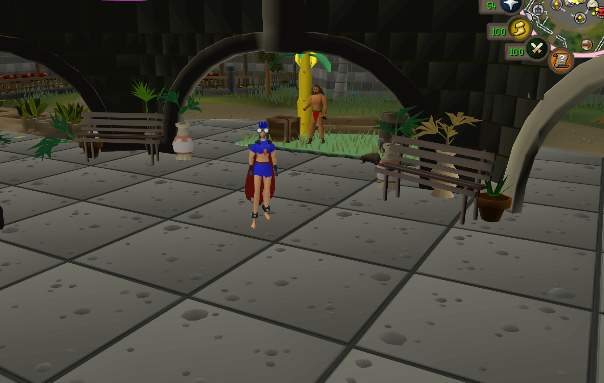
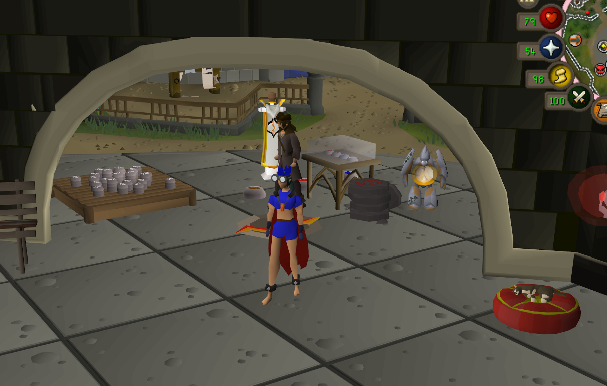
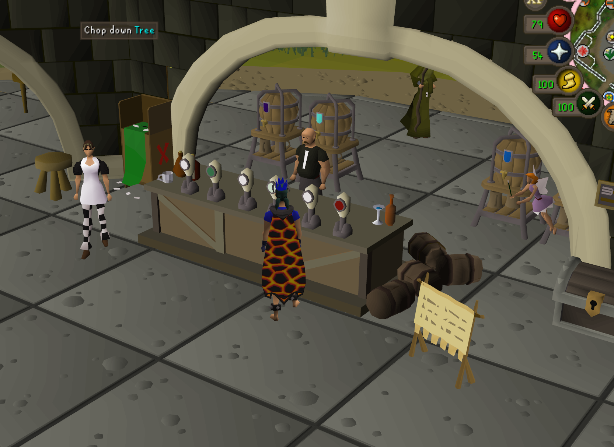

# Station's Cozy Clutter

Build your own cosy corners of Gielinor with static scenery, animated objects, and animated NPC decorations.



Station's Cozy Clutter is a RuneLite plugin for placing game scenery as client-side props. Search a visual catalogue, attach a decoration to your cursor, and arrange anything from a tiny market stall to a full hangout space.

Builds are cosmetic: they do not alter the game server, collision, or what players without the same Tilepack see. Hope you get to express your creativity and make Gielinor juuust a little prettier while waiting for friends between raids :D

## Features

- Browse a searchable 3D catalogue of static objects, animated objects, and animated NPC decorations.
- Choose tile-centred, fine 1/8-tile, or precise 1/16-tile placement; in the fine modes, the live cursor preview follows your mouse within each tile.
- Rotate the live placement preview with the mouse wheel before placing.
- Resize, raise, lower, rotate, duplicate, or delete any placed decoration.
- Nudge props in precise 1/16-tile steps for posters, shelves, counters, and other close-fitting layouts.
- Move an existing decoration to a new tile without losing its animation, scale, height, rotation, or nudge.
- Undo recent changes from the sidebar or with Ctrl+Z while the panel is open.
- Delete an entire build with a confirmation warning, then recover it with Undo if needed.
- Share complete builds as compact, portable Tilepack codes.
- Keep old Tilepacks working: animation and nudge data are optional and backward-compatible.

## More creations

<table>
  <tr>
    <td width="50%">
      
    </td>
    <td width="50%">
      
    </td>
  </tr>
  <tr>
    <td align="center"><sub>A busy workshop full of little details</sub></td>
    <td align="center"><sub>A custom bar with animated patrons</sub></td>
  </tr>
</table>

## Run locally

This project requires Java 11 or newer.

```powershell
.\gradlew.bat test
.\gradlew.bat run
```

The `run` task starts RuneLite in developer mode with Station's Cozy Clutter loaded.

## Building with Station's Cozy Clutter

1. Enable **Station's Cozy Clutter** in RuneLite's plugin list.
2. Open the coloured-block **Station's Cozy Clutter** button in RuneLite's sidebar.
3. Choose **All decorations**, **Static objects**, **Animated**, **Animated objects**, or **Animated NPCs**.
4. Search by name, source ID, or animation ID and browse every match with the page arrows.
5. Click its 3D preview to attach the decoration to your cursor. Animated entries automatically use their matched model and animation.
6. Move over the world, use the mouse wheel to rotate the preview, and left-click to place as many copies as you like.
7. Right-click or press **Escape** to leave placement mode.

You can also hold **Shift**, right-click existing scenery, and choose **Copy to Station's Cozy Clutter**. Shift-right-click placement remains available as a fallback workflow.

Shift-right-click a tile containing a placed prop to rotate, raise, lower, resize, nudge, move, duplicate, or delete the newest prop on that tile. Nudging moves a prop north, east, south, or west in small 1/16-tile steps, up to half a tile from its anchor. **Move placed object** attaches the existing prop to the cursor so it can be repositioned without losing its size, height, rotation, animation, or nudge.

## Tilepacks

From the ground-tile **Station's Cozy Clutter** menu, use **Export Tilepack** to copy a `WB1:` code. Use **Import Tilepack** after copying someone else's code. Imported objects retain their saved world coordinates and precise nudge offsets. Older Tilepacks without nudge data remain centred on their original tiles.

Tilepacks contain only cosmetic client-side placements. Sharing a Tilepack does not change the game server or make the objects visible to players who have not imported it.

## Current limitations

- Props are visual only and have no collision.
- Animated scenery and NPC idle/walk/run/crawl loops are matched from game-cache definitions. Some definitions do not expose every quest or action animation.
- Variable/transformed definitions remain excluded when the cache cannot identify one dependable model.
- Some unusually constructed objects may need a future catalogue entry to reproduce perfectly after restarting.
- Legacy Tilepacks containing unrestricted raw cache-model IDs are skipped because some raw models can crash RuneLite. Named catalogue objects remain supported.
- Malformed and known-incompatible models are excluded from the public catalogue.
- New object and NPC sources are safety-probed for five healthy game ticks. If RuneLite is interrupted during activation, that source is automatically quarantined next launch to prevent a crash loop.
